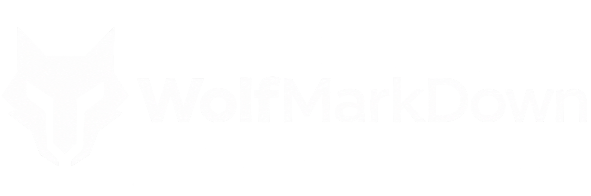

# WolfMarkDown

<!-- markdownlint-disable MD033 -->



Keep the Markdown your agent produces. WolfMarkDown is an agent publishing workflow that turns messy AI output into professional Markdown you can review and keep — with proof, not hope.

**Agent judgement for structure. Deterministic tooling for proof.**

[](https://github.com/WolfMarkTools/WolfMarkDown/releases/latest) [](https://github.com/WolfMarkTools/WolfMarkDown/actions/workflows/ci.yml) [](./LICENSE) [](https://nodejs.org/)

## What WolfMarkDown is

Agents produce useful research, plans, and documentation — but they can also flatten tables, skip headings, copy chat scaffolding, break fences, or quietly change technical identifiers. WolfMarkDown is the publishing layer for turning that output into a standalone `.md` file that can be reviewed and kept.

It keeps semantic decisions with the agent and uses deterministic tooling to prove properties of the resulting Markdown artifact before it is kept or published. It is not a generic AI Markdown formatter or a factuality checker: WolfMarkDown does not fact-check claims.

## Install

Requires **Node.js 20 or newer**.

The recommended installation is the Agent Skills CLI:

```bash
npx skills add WolfMarkTools/WolfMarkDown --skill wolfmarkdown
```

Reload the host after installation if the skill does not appear immediately. See [Installation and updates](./docs/installation.md) for Claude Code, repository checkouts, Doctor, and update instructions.

## Quick start

Once installed, ask your agent in natural language:

```text
Use WolfMarkDown on docs/architecture.md.
```

```text
Export this research as Markdown using WolfMarkDown.
```

```text
Verify docs/architecture.md with WolfMarkDown without changing it.
```

Natural-language invocation is the portable interface. Some hosts also present the same intents as slash commands, such as `/wolfmarkdown verify docs/architecture.md`; slash-command presentation is host-specific.

To update an installed skill, run `npx skills update wolfmarkdown`; see [Installation and updates](./docs/installation.md) for scope-specific commands.

## Before and after

A messy agent draft may flatten a comparison into one block:

```text
Recommendation use relay_v2 for the external wallet flow.
Comparison Provider Mode Risk Privy External approval Medium CDP Embedded wallet High.
Implementation notes relay_v2 confirms getTransaction after submission.
```

After the agent makes the structure explicit, WolfMarkDown can publish a document such as:

```markdown
# Wallet flow decision

## Recommendation

Use `relay_v2` for the external wallet flow.

## Comparison

| Provider | Mode | Risk |
| --- | --- | --- |
| Privy | External approval | Medium |
| CDP | Embedded wallet | High |

## Implementation notes

`relay_v2` confirms `getTransaction` after submission.
```

The output recovers table headings, preserves technical identifiers, and adds no information absent from the source. This is an illustrative structural example; semantic judgement remains agent-owned. WolfMarkDown recovers clear structure without inventing missing meaning.

## Why this is not Prettier

Prettier is an excellent deterministic Markdown printer. WolfMarkDown works at a different layer: it helps an agent recover and publish document structure before using Prettier as the final printer.

| Area | Prettier alone | WolfMarkDown |
| --- | --- | --- |
| Deterministic Markdown formatting | Excellent | Uses Prettier as the final printer |
| Semantic structure recovery | Not its purpose | Agent-owned and source-grounded |
| Malformed table repair | Not its purpose | Repairs clear table structure only |
| Copied agent or chat scaffolding | Not its purpose | Clean and Compose can remove it when it is clearly not document content |
| Protected-detail verification | No source-snapshot workflow | Checks recognised classes against an untouched source snapshot when supplied |
| Failed-output safety and evidence | No publishing workflow | Restores failed Clean, refuses failed Compose, and records verification evidence |

## Operations

| Operation | Purpose |
| --- | --- |
| **Compose** | Create or export a standalone `.md` file, then publish only a verified candidate. |
| **Clean** | Make the smallest necessary semantic repair to an existing Markdown file; restore the original if verification fails. |
| **Verify** | Check Markdown without changing it, with support for files, directories, and standard input. |
| **Doctor** | Inspect runtime dependencies and skill discovery without modifying Markdown. |
| **Setup** | Install or repair only what is needed for the runtime and configure skill discovery. |

Failed Clean restores the original file. Failed Compose does not publish an unverified destination.

## How it works

1. The agent reads the source, identifies clear headings, lists, tables, paragraphs, and document boundaries, and preserves genuinely ambiguous regions.
2. A source map keeps semantic decisions, protected regions, and unresolved ambiguities visible across the document.
3. Prettier provides the final Markdown print; deterministic checks cover parsing, fences, lint, idempotence, destination protection, failed-output refusal, and — when requested — integrity against the source snapshot.
4. A verification receipt and preview can record hashes, versions, checks, integrity coverage, issues, and the quality boundary.

See [Architecture and semantic repair](./docs/architecture.md) for the full workflow.

## What a PASS means

> **A WolfMarkDown PASS is Markdown-quality evidence, not content approval.**

A PASS is evidence about the applicable Markdown and artifact properties checked by WolfMarkDown. It does **not** establish:

- factual correctness;
- completeness;
- currency;
- policy compliance; or
- authorisation to publish.

Integrity is strongest when Clean or Compose compares the candidate with an untouched source snapshot. Standalone Verify can report a PASS with integrity skipped. See [Verification, integrity, and PASS](./docs/verification.md) for the detailed recognised and unrecognised token classes.

## Supported agents and compatibility

WolfMarkDown is one canonical Agent Skill. Its primary discovery convention is the shared `.agents/skills/wolfmarkdown` directory; Claude Code also has an optional `.claude/skills/wolfmarkdown` compatibility path, and a repository checkout can expose a project-local skill.

| Host           | Status                      |
| -------------- | --------------------------- |
| Codex          | **Tested**                  |
| Cursor         | **Tested**                  |
| Grok Build     | **Tested**                  |
| Claude Code    | **Tested**                  |
| OpenCode       | **Tested**                  |
| Antigravity    | **Tested**                  |
| GitHub Copilot | **Host validation pending** |

See [detailed compatibility information](./docs/installation.md#compatibility). Host acceptance and model semantic quality are separate concerns; WolfMarkDown does not promise identical results from every host or model.

## Examples

- [Mobile App Migration example](./examples/mobile-app-migration/README.md) — before-and-after recovery of tables, lists, code, protected technical values, and an intentionally ambiguous note.
- [Raw input](./examples/mobile-app-migration/input.md) — the source AI output.
- [Structured output](./examples/mobile-app-migration/output.md) — the resulting Markdown.

## Limitations

- Semantic structure remains an agent decision. WolfMarkDown does not use deterministic table or heading heuristics to manufacture meaning.
- Ambiguous row runs, headings, or labels remain conservative and are reported rather than silently promoted into structure.
- Integrity covers recognised token classes only; it is not a guarantee that every number, date, identifier, or technical value was unchanged.
- PASS is not a fact-check, completeness review, policy decision, or publication authorisation.
- Host discovery and semantic quality still depend on the agent host and model.

## Documentation

- [Installation and updates](./docs/installation.md)
- [Verification, integrity, and PASS](./docs/verification.md)
- [Architecture and semantic repair](./docs/architecture.md)
- [Validation and evidence](./docs/validation.md)
- [v1.0.0 GitHub Release](https://github.com/WolfMarkTools/WolfMarkDown/releases/tag/v1.0.0)
- [Canonical Agent Skill](./wolfmarkdown/SKILL.md)
- [Contributing](./CONTRIBUTING.md)

## Contributing

Found a Markdown failure WolfMarkDown should handle better? [Open an issue](https://github.com/WolfMarkTools/WolfMarkDown/issues) with a reproducible, synthetic or redacted example. See [Contributing](./CONTRIBUTING.md) for local checks and the project boundaries.

## Licence

WolfMarkDown is available under the [MIT Licence](./LICENSE).

## Support

If WolfMarkDown saves you from manually fixing AI-generated Markdown, [star the project on GitHub](https://github.com/WolfMarkTools/WolfMarkDown) so other users can find it.
